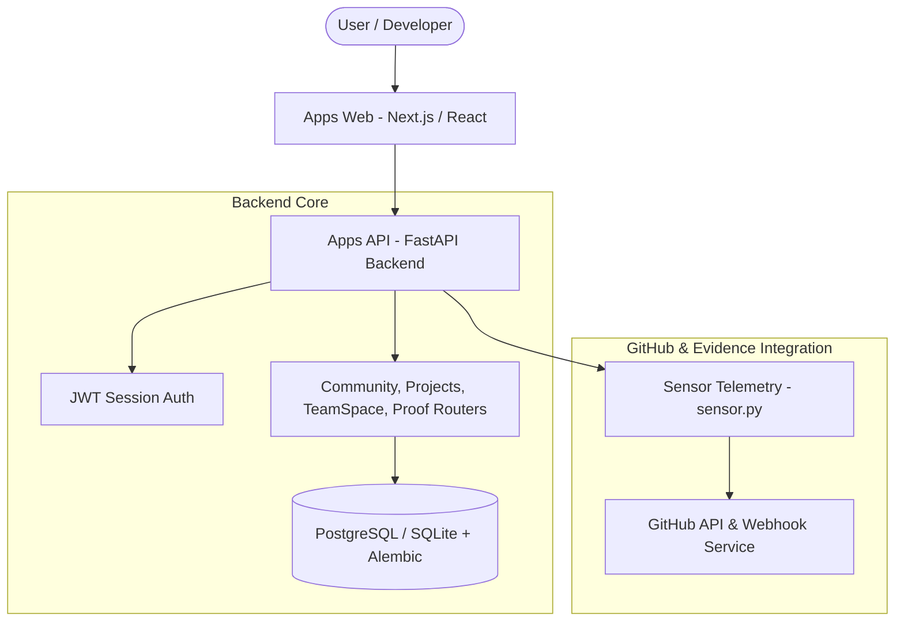

<div align="center">

  

  # Śiṣya Abhyāsa (शिष्य अभ्यास)
  ### *AI-Powered Collaborative Engineering & Proof-of-Work Platform*

  [](LICENSE)
  [](.github/workflows/ci.yml)
  [](CHANGELOG.md)
  [](https://www.python.org/)
  [](https://fastapi.tiangolo.com/)
  [](https://nextjs.org/)
  [](https://www.typescriptlang.org/)

  <p align="center">
    <a href="#-quick-start">Quick Start</a> •
    <a href="#-architecture">Architecture</a> •
    <a href="docs/README.md">Documentation</a> •
    <a href="#-repository-structure">Repository Structure</a> •
    <a href="CONTRIBUTING.md">Contributing</a>
  </p>

</div>

---

## 📖 Overview

**Śiṣya Abhyāsa** (*"Student Practice"*) is an enterprise-grade, open-source collaborative software engineering platform designed to bridge the gap between academic learning and real-world production engineering. 

By integrating **AI mentorship**, **GitHub commit telemetry**, **collaborative team spaces**, and **evidence-backed skill verification**, Śiṣya Abhyāsa empowers students, developers, and bootcamps to build real-world software while generating verifiable proof-of-work portfolios for recruiters and institutions.

---

## ✨ Key Features

- 🎯 **Three-Path Journey**:
  - **Guided Learning Path**: Structured milestone-driven project templates.
  - **Bring-Your-Own Project**: Turn existing ideas into collaborative production repositories.
  - **Community Discovery**: Discover open-source projects, join peer teams, and solve issues together.
- ⚡ **Backend Engine (`apps/api`)**: Built with FastAPI, Alembic database migrations, JWT authentication, and structured Pydantic schemas.
- 💻 **Modern Web App (`apps/web`)**: Next.js & React frontend with responsive UI, dashboard analytics, and interactive collaboration components.
- 📊 **Telemetry & Evidence Verification**: Automated GitHub sensor tracking (`sensor.py`) and evidence-backed skill claim validations.
- 🛡️ **Enterprise Security & Quality**: Strict input validation, automated pytest suite, Playwright end-to-end testing, and complete CI/CD automation.

---

## 🏗️ Architecture

Śiṣya Abhyāsa is built as a modern monorepo leveraging a decoupled client-server architecture:



---

## 🚀 Quick Start

### Prerequisites
- **Node.js**: `>= 18.0.0`
- **Python**: `>= 3.10`
- **Git**: `>= 2.30`

### Automated Setup (Recommended)

Run the multi-platform bootstrap script:

**Linux / macOS**:
```bash
chmod +x scripts/setup.sh
./scripts/setup.sh
```

**Windows (PowerShell)**:
```powershell
.\scripts\setup.ps1
```

### Manual Setup

1. **Frontend App (`apps/web`)**:
   ```bash
   cd apps/web
   npm install
   cp .env.example .env
   npm run dev
   ```
   Open `http://localhost:3000` in your browser.

2. **Backend API Service (`apps/api`)**:
   ```bash
   cd apps/api
   python -m venv venv
   source venv/bin/activate  # On Windows: venv\Scripts\Activate.ps1
   pip install -r requirements.txt
   cp .env.example .env
   uvicorn app.main:app --reload
   ```
   Open `http://localhost:8000/docs` to explore Interactive OpenAPI Swagger Documentation.

---

## 🧪 Testing & Quality Assurance

Run the automated test runner:

**Linux / macOS**:
```bash
./scripts/test.sh
```

**Windows (PowerShell)**:
```powershell
.\scripts\test.ps1
```

Or execute individual test suites:
- **API Unit & Integration Tests**: `pytest apps/api/tests`
- **Playwright E2E Tests**: `npx playwright test`
- **Linting & Code Quality**: `npm run lint`

---

## 📂 Repository Structure

```text
.
├── .github/              # GitHub Actions workflows, templates, CODEOWNERS, Dependabot
│   ├── workflows/        # CI/CD pipelines (ci.yml, lint.yml, test.yml)
│   ├── ISSUE_TEMPLATE/   # Bug report, Feature request, and Question templates
│   └── PULL_REQUEST_TEMPLATE.md
├── apps/                 # Monorepo Application Packages
│   ├── api/              # FastAPI Backend (Models, Routes, Alembic Migrations, Services)
│   └── web/              # Next.js / React Frontend Application
├── assets/               # Branding graphics, banners, logos, and UI screenshot references
├── docs/                 # Documentation Index, Developer References, Admin Guides, Sprint Logs
├── scripts/              # Cross-platform environment setup, testing, linting, backup scripts
├── tests/                # End-to-end Playwright integration test suite
├── LICENSE               # Apache License 2.0
├── SECURITY.md           # Security Policy & Vulnerability Reporting Process
├── CONTRIBUTING.md       # Developer Setup & Contribution Guidelines
├── CODE_OF_CONDUCT.md    # Contributor Covenant Code of Conduct v2.1
├── CHANGELOG.md          # Semantic Versioning History & Release Logs
├── ROADMAP.md            # Strategic Product & Technical Roadmap
└── README.md             # Project Master Landing Page
```

---

## 🛣️ Roadmap & Vision

Check our [ROADMAP.md](ROADMAP.md) for detailed milestone plans:
- **v1.0.0**: Base platform release, evidence engine, community discovery.
- **v1.0.1**: Real-time WebSockets integration for team space chat.
- **v1.1**: Automated GitHub App integration & AI Mentor code reviews.
- **v2.0**: Multi-tenant institutional portal & cloud container sandboxes.

---

## 🤝 Contributing

We welcome contributions! Please review our [CONTRIBUTING.md](CONTRIBUTING.md) and [CODE_OF_CONDUCT.md](CODE_OF_CONDUCT.md) before getting started.

1. Fork the Repository.
2. Create a Feature Branch (`git checkout -b feat/amazing-feature`).
3. Commit your changes following [Conventional Commits](https://www.conventionalcommits.org/).
4. Push to the branch (`git push origin feat/amazing-feature`).
5. Open a Pull Request.

---

## 🛡️ Security Policy

Security disclosures are handled responsibly. Please review our [SECURITY.md](SECURITY.md) for vulnerability reporting guidelines.

---

## 📜 License

Distributed under the **Apache License 2.0**. See [`LICENSE`](LICENSE) for details.

---

## 💖 Acknowledgements & Community

Special thanks to all contributors, mentors, and institutions supporting the **Śiṣya Abhyāsa** initiative!
