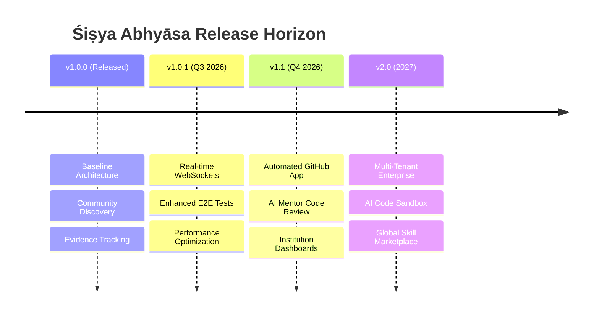

# Śiṣya Abhyāsa Product Roadmap

This document outlines the strategic product roadmap for **Śiṣya Abhyāsa**, detailing upcoming releases, target milestones, and key technical capabilities.

---

## Roadmap Overview

---

## Release Milestones

### Version 1.0.0 (Current Baseline) :white_check_mark:
- [x] Full FastAPI backend service (`apps/api`) with SQLite/PostgreSQL support.
- [x] Clean Next.js + React UI prototype (`apps/web`).
- [x] Alembic database schema migrations (`0001_users` to `0010_community_discovery`).
- [x] Proof-of-Work evidence publishing & GitHub sensor integration.
- [x] Open-source repository infrastructure, CI/CD, and governance documentation.

### Version 1.0.1 (Patch Release - Near Term) :rocket:
- [ ] Implement WebSocket endpoints for real-time team space messaging.
- [ ] Expand Playwright E2E test coverage across onboarding and project creation.
- [ ] Optimize API response latency and query execution times.
- [ ] Add Docker production deployment compose manifests.

### Version 1.1 (Minor Release - Next Quarter) :sparkles:
- [ ] Full GitHub App integration with automated webhook handling.
- [ ] Server-side AI Mentor integration for automated code review suggestions.
- [ ] Institutional & Mentor dashboards for progress monitoring.
- [ ] Automated skill badge verification linked to verified commit hashes.

### Version 2.0 (Major Release - Long Term) :earth_africa:
- [ ] Multi-tenant enterprise deployment support for universities and engineering bootcamps.
- [ ] Isolated cloud container code sandbox for live project execution.
- [ ] Global verified developer portfolio registry.

---

## Feedback & Feature Requests

Have a feature request or suggestion? Join the discussion on our [GitHub Discussions](https://github.com/ValabojuAnuvardhan/sisya-abhyasa/discussions) or submit a [Feature Request Form](.github/ISSUE_TEMPLATE/feature_request.md).
